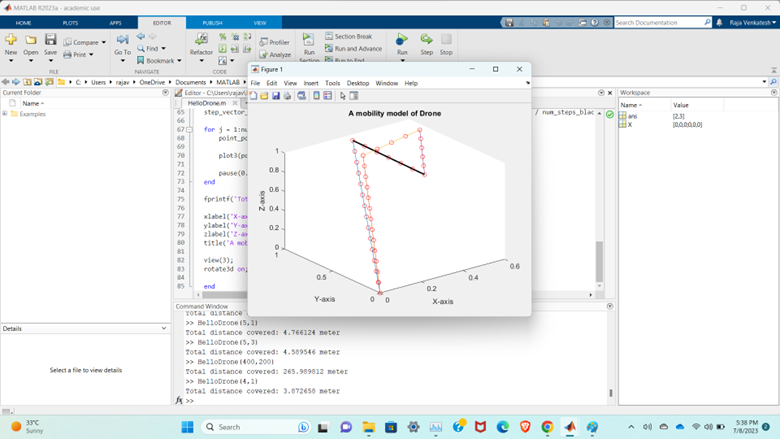
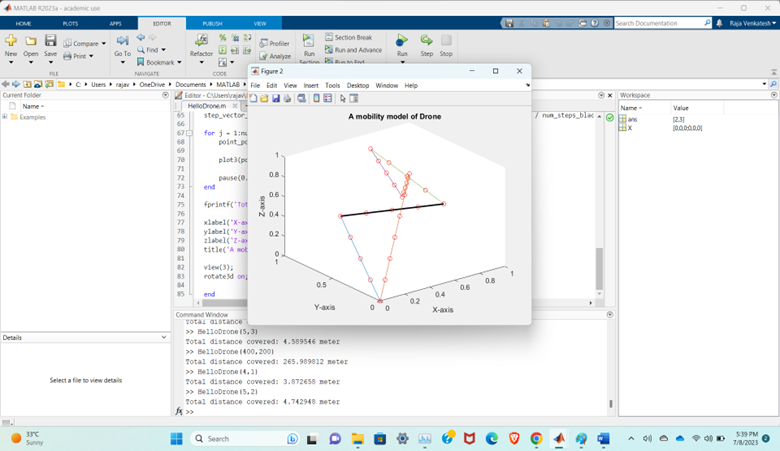
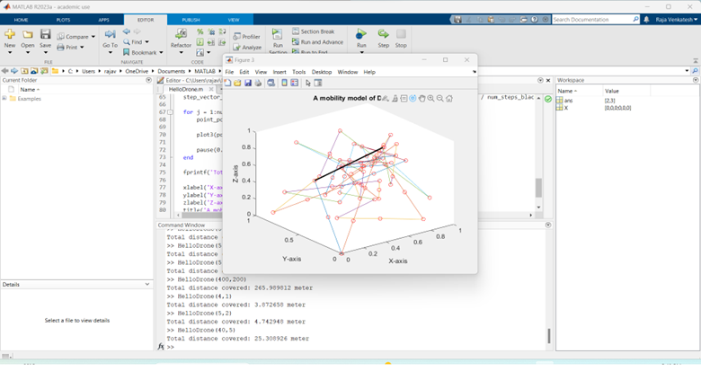

# A Mobility Model for Drone Simulation

## Project Overview
This project implements a mobility model for drone path simulation using MATLAB. The simulation generates a 3D plot of a drone's path in space, calculates the total distance traveled, and visualizes the movement step by step. The program provides insights into drone dynamics and path planning in 3D space.

---

## Features
- **3D Path Simulation**: Visualizes the drone's trajectory in a 3D space.
- **Dynamic Visualization**: Simulates the drone's movement in real time.
- **Distance Calculation**: Computes the total distance traveled by the drone.
- **Customizable Parameters**: Allows users to set the number of path segments and the drone's velocity.

---

## Prerequisites
- MATLAB R2020a or later
- Basic understanding of MATLAB programming

---

## Usage
1. Clone this repository:
   ```bash
   git clone https://github.com/your-username/DroneSimulationProject.git
   ```
2. Navigate to the `code/` directory.
3. Open `HelloDrone.m` in MATLAB.
4. Run the script with the desired parameters, for example:
   ```matlab
   HelloDrone(10, 2.5);
   ```
   Here, `10` represents the number of path segments, and `2.5` is the drone's velocity.

---

## Outputs
- **3D Visualization**: Displays the drone's path in a new figure window.
- **Total Distance**: Prints the total distance traveled by the drone in the MATLAB command window.

---

## Example Snapshots

*Figure: Number of lines is greater than velocity, both values are positive*


*Figure: Number of lines is greater than velocity, both values are positive*


*Figure: The number of lines is greater than velocity, both values are positive, and a large value was taken.*


*Figure: Velocity was used negatively to check the behavior of the plot and code*


*Figure: The number of lines was taken as negative. It threw an error. Therefore, change the values to a velocity greater than the number of lines.*


*Figure: The velocity parameter was assigned to zero. This triggered an infinite loop and caused an error.*


*Figure 7*


*Figure: Number of lines was assigned as zero, it resulted in error and no plot was generated*

---
