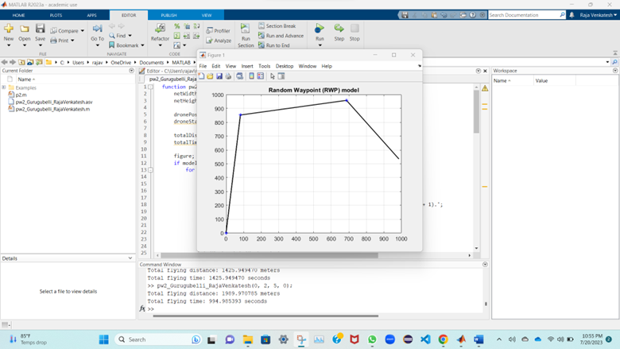
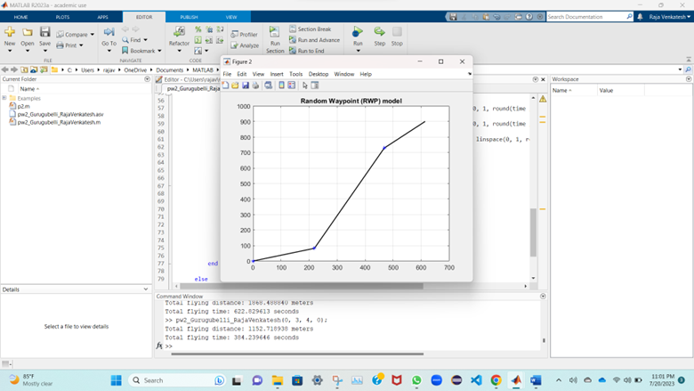
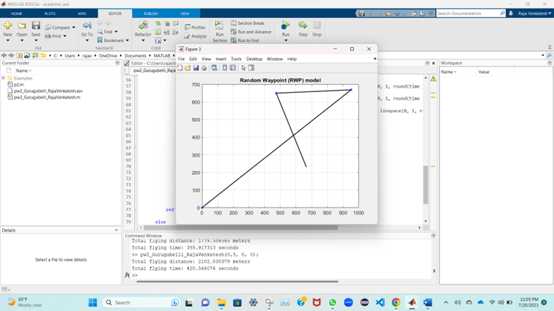
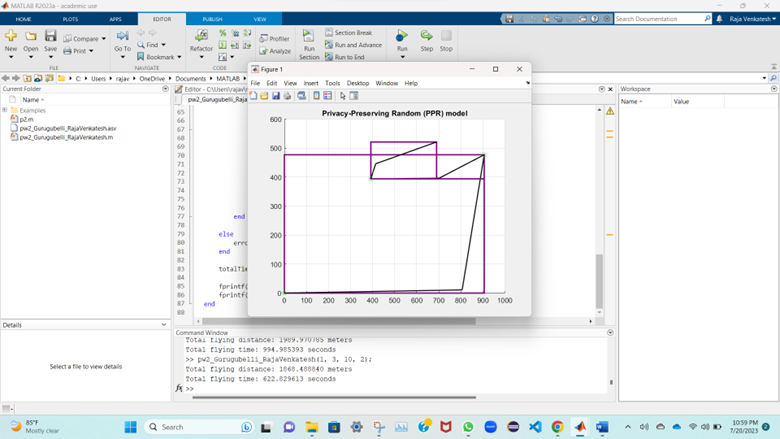
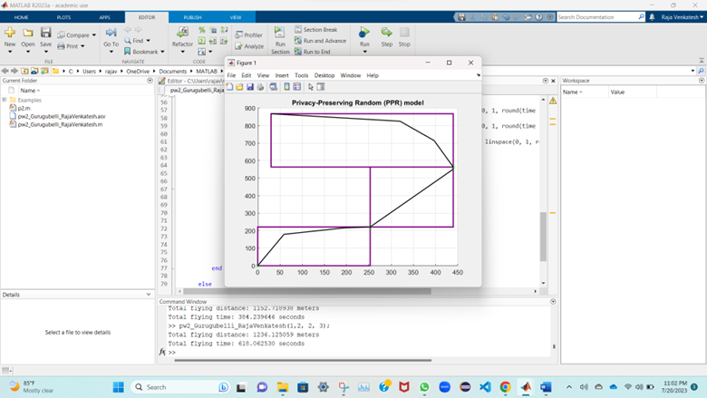
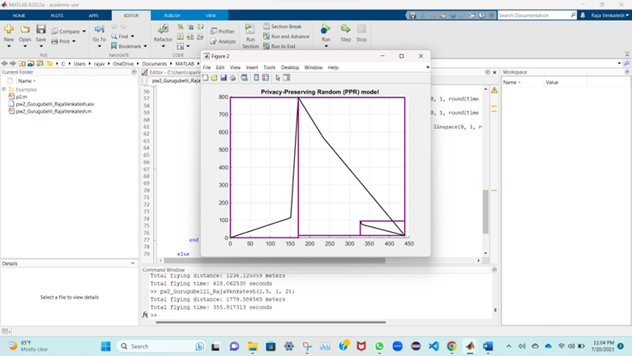

Privacy-Preserving Drone Mobility
Simulate two simple mobility models: (i) Random Waypoint (RWP) and Privacy-Preserving Random (PPR).
In RWP, a drone chooses a random destination within a 1,000 x 1,000 (m2) network, 2-dimensional network. The drone flies toward the destination. Upon arrival, the drone stays during a pausing time.
Then the drone chooses another random destination within the network and flies toward the destination.
The drone repeats the same procedure.
 In PPR, a drone chooses a random destination within the network. Rather than flying straight to the destination, the drone builds a virtual rectangle with a diagonal starting from its current location to the destination and generates several dummy locations (k) located with the rectangle. Then the drone flies toward the destination through all the dummy locations, e.g., from the closest located dummy location first.
 For visualization, use a solid line for the drone path, and mark the drone location every one second interval. For RWP and PPR, mark the drone as ‘*’ (start) and ‘o’ (empty circle), respectively.
2. Input parameters
• Mobility model: 0 for RWP and 1 for PPR
• Velocity: 1 to 5 m/sec
• Pausing time: 0 to 10 secs
• Number of dummy location (k): 2 or 3
3. Run at least twice for each mobility model by changing input parameters. For example, type the
following in the command window. For PPR, show the results when k is 2 or 3.
• >> mobility(0, 2, 5, 0) % RWP, 2 m/s, 5 secs pausing time, zero
dummy location
• >> mobility(1, 3, 10, 2) % PPR, 3 m/s, 10 secs pausing time, two
dummy locations
4. Measure the performance for each mobility model.
• Total flying distance from the base, left and bottom of the network (0, 0)
• Total flying time

Report
Steps to run the code:
1.	Launch the MATLAB software on your computer.
2.	Click "File" in the top menu of the MATLAB editor or script window.
3.	Select "Open" from the dropdown menu and navigate to the folder containing your.m file.
4.	Choose the.m file to execute and click "Open."
5.	The file's code will be displayed in the MATLAB editor.
6.	Simply click the "Run" button (typically a green triangle icon) in the toolbar or hit the "F5" key on your keyboard to run the code.
7.	The code will be executed, and any results or plots produced by it will be displayed in the MATLAB command window or in other figure windows.
8.	Now, let's test the mobility function using the inputs you provided:

•	La_anc (0, 2, 5, 0) % RWP, 2 m/s, 5 secs pausing time, zero dummy location
•	La_anc(1, 3, 10, 2) % PPR, 3 m/s, 10 secs pausing time, two dummy locations

Copy and paste the preceding code into the MATLAB command or script window, and then hit the "Run" or "F5" key to run the function with the specified inputs. The function will depict the drones' trajectories depending on the mobility model (RWP or PPR) and the parameters supplied (drone speed, pause time, and number of dummy sites). The entire flight distance and time will also be displayed in the command window.
Results:
1.RWP Model: Random waypoint

Fig 1.1
The above image is implemented with inputs as La_Anc(0,2,5,0)
Analysis:
•	The first parameter is used to select the RWP model. 
•	The second parameter is used to select the velocity, which means the speed we assume that the drone will travel at. Here we assumed it as 2m/s. 
•	The third parameter is used to select the time the drone will pause after reaching a location. In RWP it will be after reaching the location and before planning the next random destination. The unit of pause will be sec. here we took 5 sec as pause time.
•	The fourth and last parameter is used for determining the number of dummy nodes we take between the start and destination nodes. In RWP model we don’t have dummy nodes, so we take them as 0.
•	In the console we get Total flying distance from first start to destination including using 1989.97 meters
•	We also get total flying time as 994.98 seconds.

Fig 1.2
The above image is implemented with inputs as La_Anc(0,3,4,0)

 

Fig 1.3
The above image is implemented with inputs as La_Anc(0,5,8,0)
2.PPR Model : Privacy- preserving Random

Fig 2.1
The above image is implemented with inputs as La_Anc(1,3,10,2)
Analysis:

•	The first parameter is used to select the PPR model. 
•	The second parameter is used to select the velocity, which means the speed we assume that the drone will travel at. Here we assumed it as 3m/s. 
•	The third parameter is used to select the time the drone will pause after reaching a location. In PPR it will be after reaching the location and before planning the next random destination. The unit of pause will be sec. here we took 10 sec as pause time.
•	The fourth and last parameter is used for determining the number of dummy nodes we take between the start and destination nodes. In PPR Model we use dummy nodes to alter the route the drone takes here we took 2 dummy nodes.
•	In the console we get Total flying distance from first start to destination including using 1868.48 meters
•	We also get total flying time as 622.82 seconds.

Fig 2.2
The above image is implemented with inputs as La_Anc(1,2,2,3)

Fig 2.3
The above image is implemented with inputs as La_Anc(1,5,1,2)
Explanation:
In the Random Waypoint (RWP) model, we simulate the movement of a drone in a 2D network area. The drone starts at the origin (0,0) and moves randomly within the given area. The model is designed to mimic real-life scenarios where a drone might move from one location to another in an unpredictable manner.
Here's how the RWP model works:
1.	We define a rectangular network area with a width and height of 1000 units.
2.	The drone starts at the origin (0,0) and has a specified speed (droneSpeed) in meters per second.
3.	The simulation runs for three iterations, where the drone moves multiple times.
4.	In each iteration, the drone selects a random destination point within the network area.
5.	The distance between the current position of the drone and the destination is calculated using the Euclidean distance formula.
6.	The time required to travel from the current position to the destination is calculated based on the drone's speed.
7.	The trajectory from the current position to the destination is divided into small segments, and we update the drone's position incrementally along this trajectory to visualize smooth movement.
8.	The trajectory is plotted on the figure in black with a line width of 1.5, representing the path the drone follows.
9.	We mark the starting position of the drone with a blue asterisk on the figure.
10.	The plot is updated in real-time, showing the drone's movement as it moves towards the randomly selected destination.
11.	Once the drone reaches the destination, it pauses for a specified duration (pauseDuration) to simulate a brief stop before moving again.
12.	The drone then selects another random destination, and the process repeats for the specified number of iterations.
13.	At the end of the simulation, the function calculates the total flying distance covered by the drone and the total flying time based on the speed and distance traveled.
The RWP model allows us to observe how the drone moves randomly across the network area, visiting different locations in an unpredictable manner. This model can be useful for studying the mobility patterns of drones in various scenarios and understanding their behavior when moving from one point to another in real-world applications.

In the Privacy-Preserving Random (PPR) model, we simulate the movement of a drone in a 2D network area while considering privacy concerns. The model is designed to mimic real-life scenarios where a drone might need to conceal its path to protect sensitive information or avoid revealing its destination to potential threats.
1. We define a rectangular network area with a width and height of 1000 units.
2. The drone starts at the origin (0,0) and has a specified speed (droneSpeed) in meters per second.
3. The simulation runs for three iterations, where the drone moves multiple times.
4. In each iteration, the drone selects a random destination point within the network area.
5. The distance between the current position of the drone and the destination is calculated using the Euclidean distance formula.
6. The time required to travel from the current position to the destination is calculated based on the drone's speed.
7. The trajectory from the current position to the destination is divided into small segments, and we update the drone's position incrementally along this trajectory to visualize smooth movement.
8. To maintain privacy, the drone creates a privacy zone by defining a rectangle that encompasses the current position and the destination. The rectangle's edges are parallel to the x and y axes, forming a privacy zone to hide the exact path.
9. Inside the privacy zone, the drone generates a random set of dummy locations. These dummy locations are intended to confuse potential observers or malicious entities about the drone's actual destination.
10. The drone follows a path that connects its current position to the first dummy location, then moves from one dummy location to the next in a sequence, and finally travels from the last dummy location to its actual destination.
11. The trajectory of the drone, along with the dummy locations, is plotted on the figure. The drone's path from the current position to the first dummy location is represented by a black line. The dummy locations are indicated by small circles.
12. The actual destination of the drone is not revealed in the plot, preserving privacy.
13. The plot is updated in real-time, showing the drone's movement and the privacy zone as it moves towards the randomly selected destination.
14. Once the drone reaches the destination, it pauses for a specified duration (pauseDuration) to simulate a brief stop before moving again.
15. The drone then selects another random destination, and the process repeats for the specified number of iterations.
16. At the end of the simulation, the function calculates the total flying distance covered by the drone and the total flying time based on the speed and distance traveled.
The PPR model allows us to observe how the drone moves in a way that preserves its privacy by creating confusion about its actual destination. This model can be useful for studying the potential strategies drones might adopt to protect sensitive information while operating in real-world scenarios where privacy and security are critical considerations.

